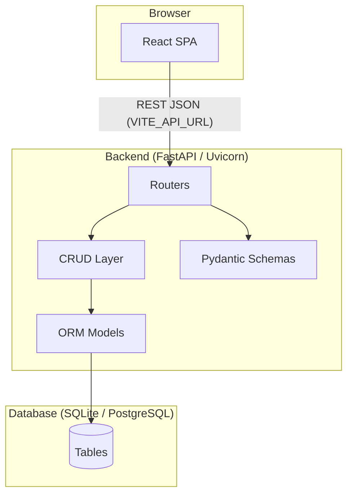
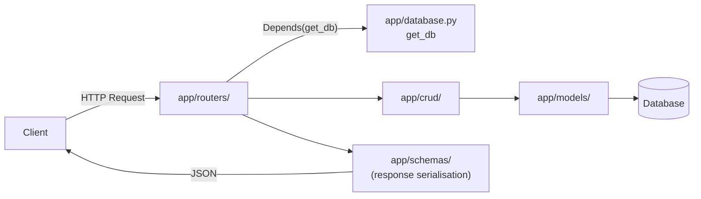
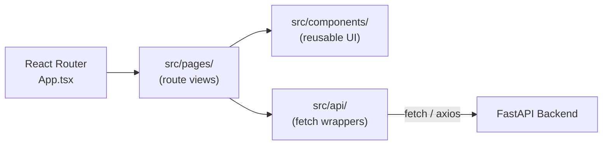
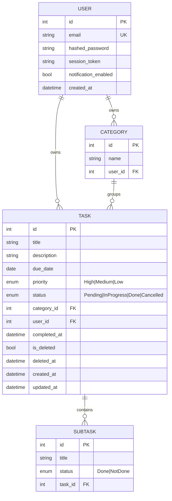
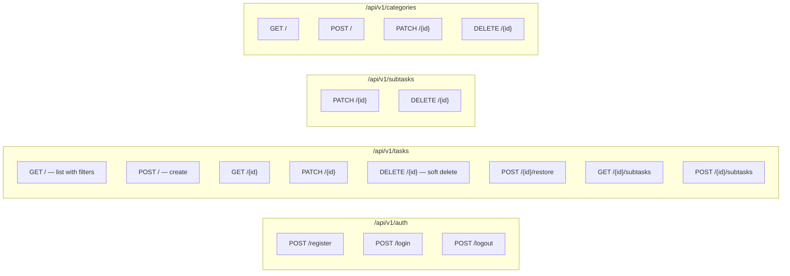
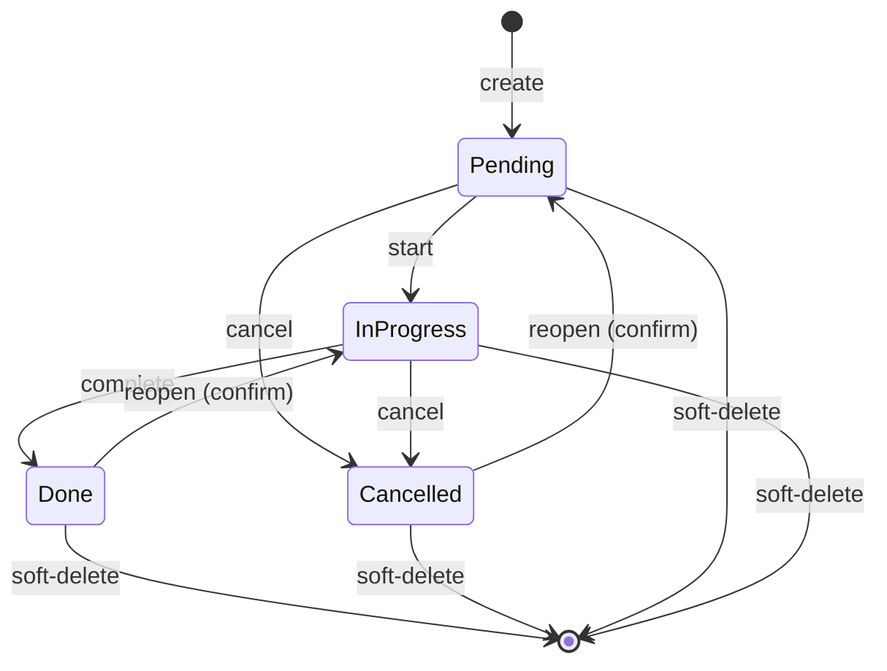
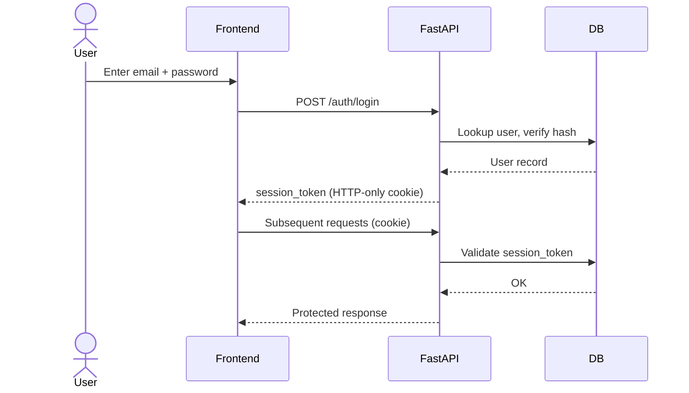
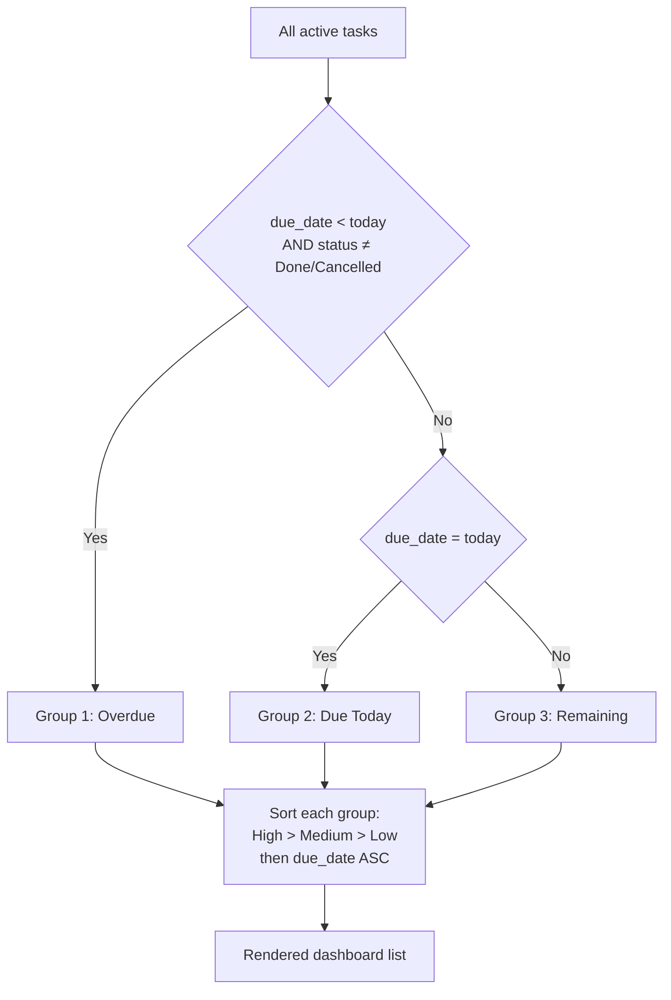
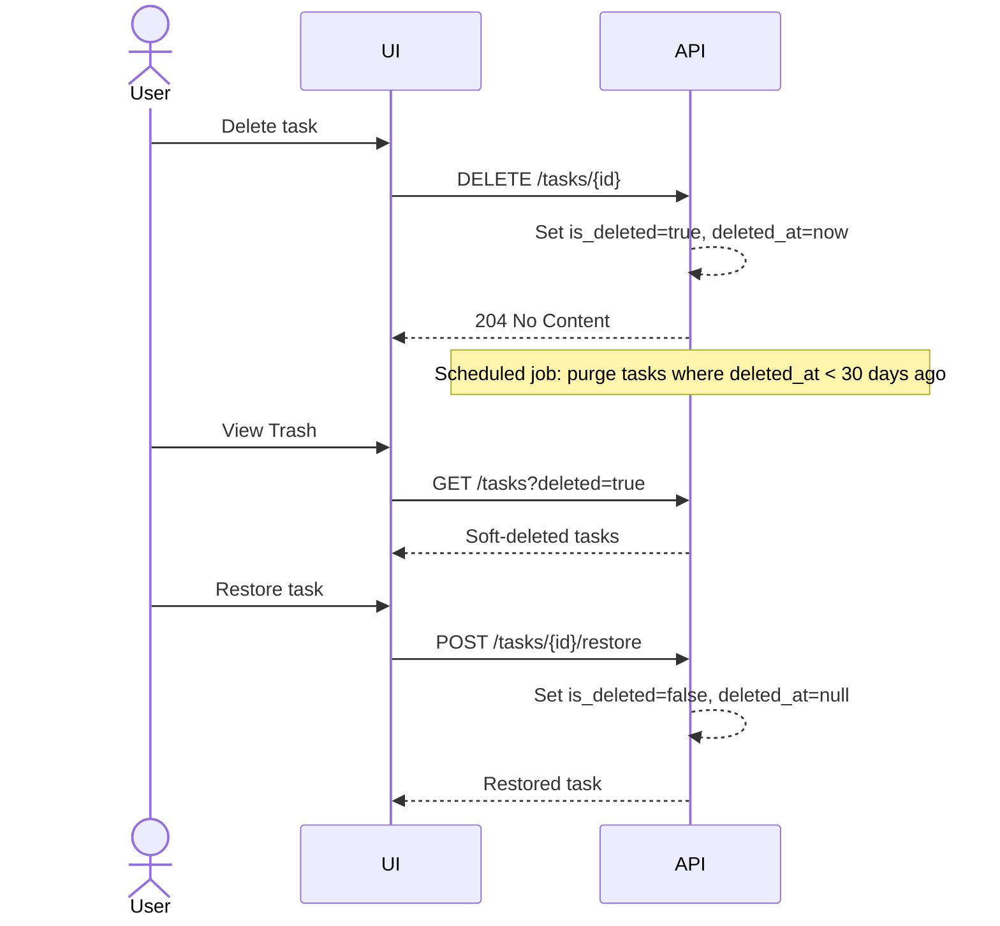

# Architecture — Task Management Application

## 1. System Overview

A full-stack task management web application. Users can create tasks with sub-tasks, categories, priorities, and due dates. The system enforces authentication and provides deadline-aware dashboard views.

**Tech stack:** FastAPI (Python) · SQLAlchemy + Alembic · Pydantic v2 · React (TypeScript) · Vite · React Router

---

## 2. High-Level Architecture

---

## 3. Backend Layer Diagram

### Layer responsibilities

| Layer | Path | Responsibility |
|---|---|---|
| Routers | `app/routers/` | HTTP verbs, request parsing, dependency injection, response shape |
| CRUD | `app/crud/` | All DB read/write; only layer touching the ORM session |
| Models | `app/models/` | SQLAlchemy table definitions, relationships |
| Schemas | `app/schemas/` | Pydantic v2 request/response models, validation rules |
| Database | `app/database.py` | Engine, `SessionLocal`, `get_db` FastAPI dependency |
| Entry point | `app/main.py` | App instantiation, CORS config, router registration |

---

## 4. Frontend Layer Diagram

### Layer responsibilities

| Layer | Path | Responsibility |
|---|---|---|
| App shell | `src/App.tsx` | React Router setup, global providers |
| Pages | `src/pages/` | Route-level views; owns local and server state |
| Components | `src/components/` | Stateless, reusable UI primitives |
| API client | `src/api/` | Thin typed wrappers around HTTP calls; one file per resource |

---

## 5. Domain Model

---

## 6. API Endpoints

---

## 7. Task Status Lifecycle

> Transitioning back from **Done** or **Cancelled** requires explicit user confirmation.

---

## 8. Authentication Flow

---

## 9. Dashboard Sorting Logic

---

## 10. Soft-Delete & Recovery

---

## 11. Key Design Decisions

| Decision | Choice | Rationale |
|---|---|---|
| Session auth vs JWT | Server-managed session token | Safer for browser apps; avoids token-storage XSS risk |
| Soft delete | `is_deleted` + `deleted_at` flags | 30-day recovery requirement; preserves audit trail |
| Category deletion | Tasks become uncategorised (not deleted) | Data preservation; user may re-assign later |
| Parent task deletion | Cascades to sub-tasks (with warning) | Orphaned sub-tasks have no meaning without parent |
| Due date past guard | Block on create, allow on edit | UX: editing an already-overdue task is legitimate |
| Frontend API layer | Isolated `src/api/` wrappers | Components never contain raw `fetch`; easy to mock in tests |
